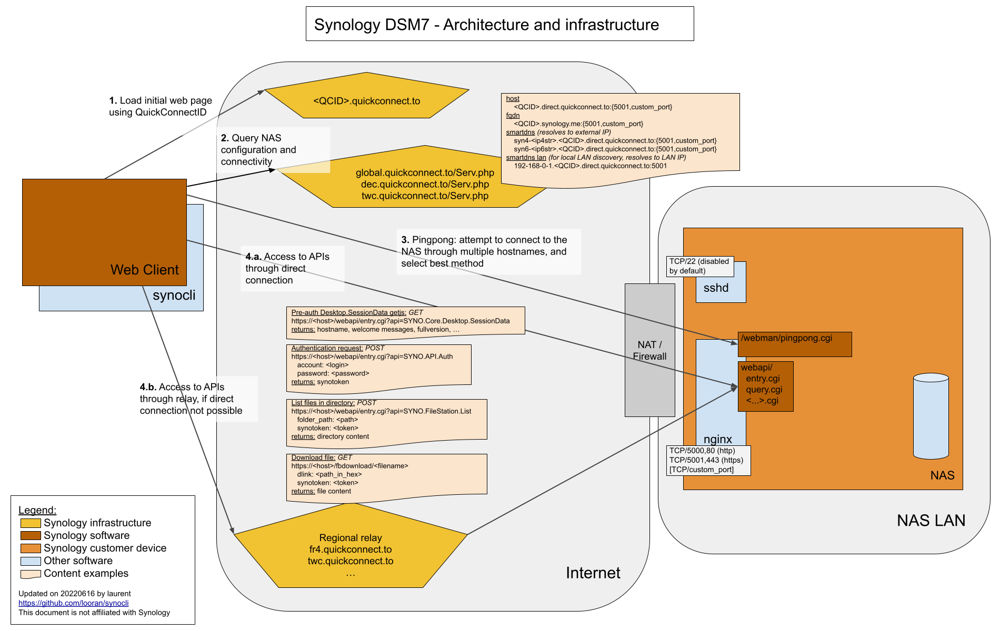

## Synology NAS file management from command-line

synocli is a command-line tool and Python API than interacts with a DSM7 based Synology device using the Web API:
* **download files with multiple threads** and automatic resume
* list files
* provide interactive python shell to query the APIs
* connection in direct using https://ip|fqdn:port of your device
* connection through **QuickConnect** using your QuickConnect ID




It allows to fetch files efficiently from a Synology NAS whithout shell access on the device.

### synocli usage

```
usage: synocli.py [-h] [-k] [-l LOGIN] [-L] [-p PASSWORD] [-v]
                  [-z TEMPORISATION]
                  url_or_qcid {ls,get,interact} ...

Synology NAS file management from command-line
v0.1 - 2022 Laurent Ghigonis <ooookiwi@gmail.com>

positional arguments:
  url_or_qcid           DSM url as http[s]://ip|fqdn:port or QuickConnect ID
  {ls,get,interact}     action
    ls                  [-R] [<directory>] list directory or root
    get                 [-R] <path> [<out>] download file
    interact            interactive shell

optional arguments:
  -h, --help            show this help message and exit
  -k, --insecure        skip SSL certificate verification in all HTTPS connections
  -l LOGIN, --login LOGIN
  -L, --lan             enable connection to LAN IPs
  -p PASSWORD, --password PASSWORD
  -v, --verbose         verbose display, 2 for debug, 3 for debug http requests
  -z TEMPORISATION, --temporisation TEMPORISATION
                        temporisation, default=2

# list files through QuickConnect
synocli <quickconnect_id> list
# list files through QuickConnect, specifying login and password on the command-line
synocli -l admin -p 'MyPassword' <quickconnect_id> list
# list files through direct connection
synocli https://192.168.1.19:5001 list
# get file through QuickConnect
synocli <quickconnect_id> get /share1/document.pdf
# get all files recursively in a directory through QuickConnect
synocli <quickconnect_id> get -R /share1/my_directory
# start interactive mode
synocli <quickconnect_id> interact
```

### interactive mode

```

Interactive mode
^^^^^^^^^^^^^^^^
show this help
   synohelp
available functions
   syno.ls([path], recursive=False)
   syno.get(path, [outpath|-], recursive=False)
   syno.api_desktop_defs()
   syno.api_security()
   syno.api_info()
   syno.api_desktop_initdata_user_service()
   syno.api_package_status()
   syno.api_desktop_ui_configuration()
   syno.api_systeminfo_storage()
available objects
   syno.infos
change debug level
   logging.getLogger().setLevel(logging.DEBUG)

running ipython...
```

### synocli architecture

#### downloader (action 'get')

The downloader is multi-threaded and starts downloading files as soon as they are found by the recursive file listing.

You can specify the number of threads (-t), but the default of 2 should be good for all usages. Increasing the thread number will put higher pressure on disk IOs, potentialy decreasing performance.

When doing a recursive download (-R), synocli skip files that have same size and older or same modification time that the local files.

### Requirements

python3
```
requests
beautifulsoup4
tqdm
```

Install requirements using pip:
```
pip install -r requirements.txt
```

### Similar projects and ressources

* synology-api from Renato (N4S4) allows to query many APIs of a Synology device from python

It does not support QuickConnect.

https://github.com/N4S4/synology-api/

* synoadm allows you to push custom SSL certificate for your Synology device, and set an htaccess on the web interface.

https://github.com/looran/synoadm
